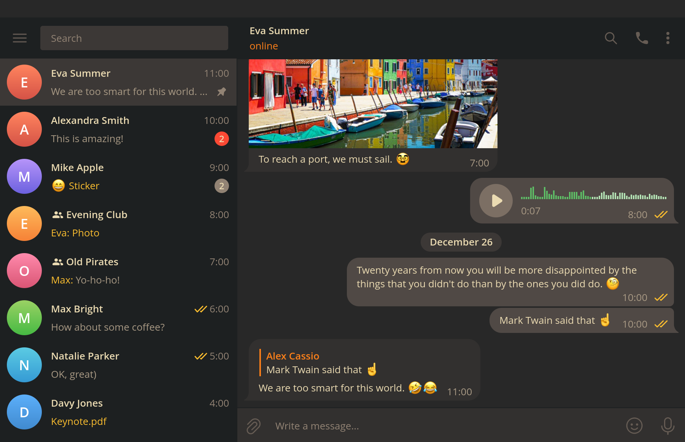

[gruvbox](https://github.com/morhetz/gruvbox) theme for [tdesktop](https://github.com/telegramdesktop/tdesktop) with a touch of [gruvbox-material](https://github.com/sainnhe/gruvbox-material).



## Installation

1. Download `gruvbox.tdesktop-theme` from the [releases page](https://github.com/indev29/telegram-gruvbox/releases).
2. Use Settings menu to select the theme or just send `gruvbox.tdesktop-theme` to yourself in Telegram and click on the message.
3. Click "Apply this theme".

## Manual Build

Clone repo:
```bash
git clone https://github.com/indev29/telegram-gruvbox.git
```

Pack background and colors files: 
```bash
zip gruvbox.tdesktop-theme background.png colors.tdesktop-theme
```

## Customization

You may not like some of the decisions made for this theme.

To change the colors, edit `colors.tdesktop-theme` and follow [manual build](#manual-build) instructions to generate new theme file.

Some particular options you may want to edit are listed below.

### Showing scroll bar

```
scrollBarBg: none; // default scroll bar current rectangle, the bar itself (like in chats list)
scrollBg: none; // default scroll bar background
scrollBarBgOver: none; // default scroll bar current rectangle with mouse over it
scrollBgOver: none; // default scroll bar background with mouse over the scroll bar

historyScrollBarBg: scrollBarBg; // scroll bar current rectangle, the bar itself in the chat view (adjusted)
historyScrollBarBgOver: scrollBarBgOver; // scroll bar current rectangle with mouse over it in the chat view (adjusted)
historyScrollBg: scrollBg; // scroll bar background (adjusted)
historyScrollBgOver: scrollBgOver; // scroll bar background with mouse over the scroll bar (adjusted)
```

### Showing title buttons (minimize, maximize, close)

```
titleButtonBg: none; // custom window title minimize/maximize/restore button background when window is inactive (Windows only)
titleButtonFg: none; // custom window title minimize/maximize/restore button icon when window is inactive (Windows only)
titleButtonCloseBg: none; // custom window title close button background when window is inactive (Windows only)
titleButtonCloseFg: none; // custom window title close button icon when window is inactive (Windows only)

titleButtonBgOver: titleButtonBg; // custom window title minimize/maximize/restore button background with mouse over when window is inactive (Windows only)
titleButtonFgOver: titleButtonFg; // custom window title minimize/maximize/restore button icon with mouse over when window is inactive (Windows only)
titleButtonCloseBgOver: titleButtonBgOver; // custom window title close button background with mouse over when window is inactive (Windows only)
titleButtonCloseFgOver: titleButtonFgOver; // custom window title close button icon with mouse over when window is inactive (Windows only)

titleButtonBgActive: titleButtonBg; // custom window title minimize/maximize/restore button background when window is active (Windows only)
titleButtonFgActive: titleButtonFg; // custom window title minimize/maximize/restore button icon when window is active (Windows only)
titleButtonCloseBgActive: titleButtonCloseBg; // custom window title close button background when window is active (Windows only)
titleButtonCloseFgActive: titleButtonCloseFg; // custom window title close button icon when window is active (Windows only)

titleButtonBgActiveOver: titleButtonBgOver; // custom window title minimize/maximize/restore button background with mouse over when window is active (Windows only)
titleButtonFgActiveOver: titleButtonFgOver; // custom window title minimize/maximize/restore button icon with mouse over when window is active (Windows only)
titleButtonCloseBgActiveOver: titleButtonCloseBgOver; // custom window title close button background with mouse over when window is active (Windows only)
titleButtonCloseFgActiveOver: titleButtonCloseFgOver; // custom window title close button icon with mouse over when window is active (Windows only)
```

## Contribution

Have a suggestion? Open an [Issue](https://github.com/indev29/telegram-gruvbox/issues)!
